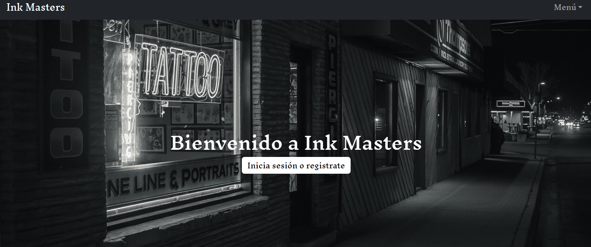
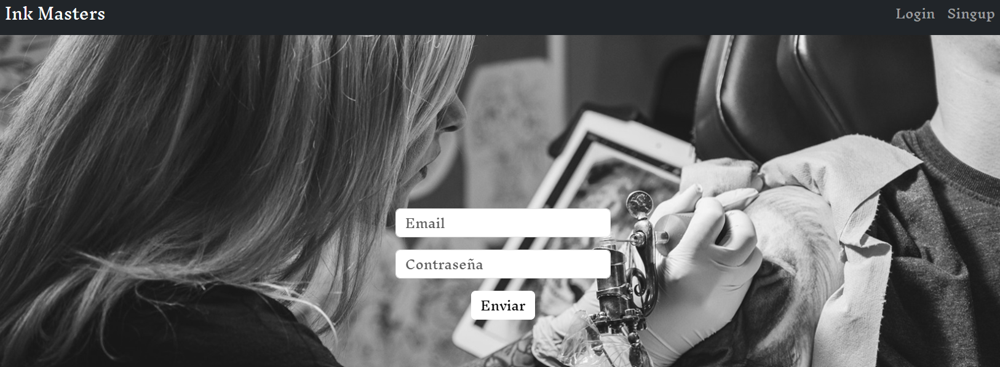
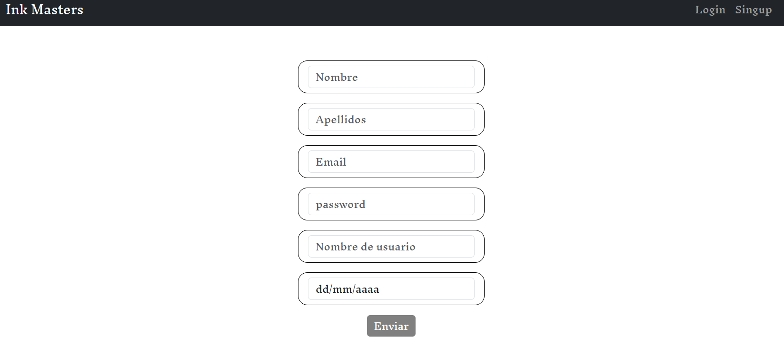
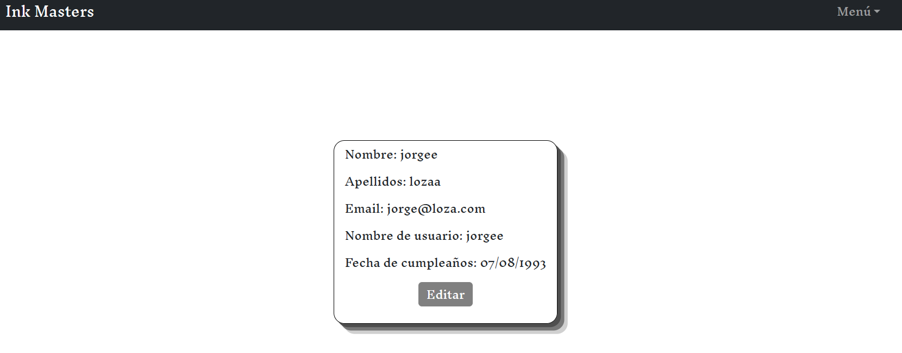
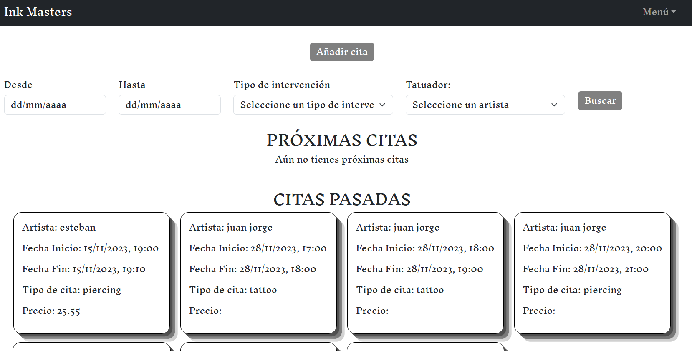
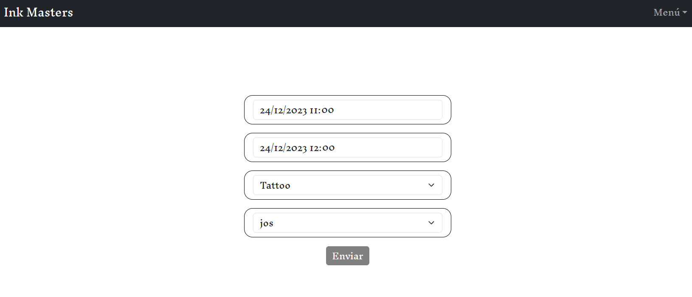

# Ink Masters

Es una pagina web, en la cual te tienes que registrar y una vez dentro podras agendarte una cita con uno de nuestros tatuadores

## Construido con 🛠️

* [BOOTSTRAP](https://getbootstrap.com/) - Usado para la estructura base de la web y el responsive
* [REACT](https://es.react.dev/) 
* [AXIOS](https://axios-http.com/es/docs/intro) 
* [JWT-DECODE](https://www.npmjs.com/package/jwt-decode) 
* [REACT-REDUX](https://es.redux.js.org/) 
* [REACT-ROUTER-DOM](https://www.npmjs.com/package/react-router-dom)     

## Wiki 📖

Ahora te explicaremos como funciona nuestra web.

Home
 

 
Página principal, nos encontraremos 1 boton, al hacer click sobre el nos llevara a la pagina de login

LOGIN

En esta página introduciremos nuestro email y contraseña para poder acceder

SINGUP
 

En esta página, rellenaremos los campos para poder crearnos una cuenta y poder acceder a la web

Perfil

En esta página podremos ver nuestro datos personales y si hacemos click en el boton de editar se habilitaran los campos para que podemos modificar los datos

CITAS

En esta página se mostrarán todas las citas que tengamos agendadas para futuro y también veremos nuestras citas anteriores, en esta página, también veremos un botón "Agregar cita" y un buscador que nos servira para filtrar las citas

CITA DETALLE

En esta pagina veremos la cita seleccionada con toda la información relevante de esta. 

## Autores ✒️

* **Jorge Loza Guzmán** - *Trabajo Inicial* -  *Documentación* - [JorgeLozaDev](https://github.com/JorgeLozaDev)

## Licencia 📄

Este proyecto está bajo la Licencia (LICENSE) - mira el archivo [LICENSE](LICENSE) para detalles

---
⌨️ por [JorgeLozaDev](https://github.com/JorgeLozaDev) 